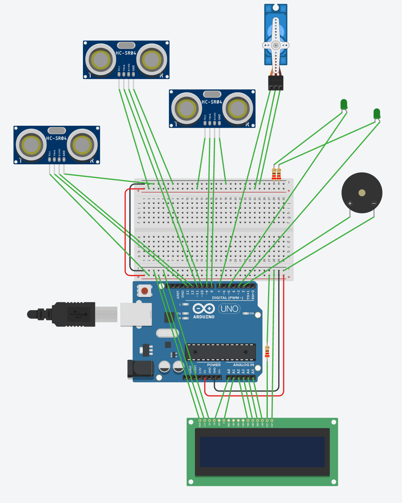

# Smart Parking Lot

## Project Description

The goal of this project is to create a small smart parking lot prototype
using an **Arduino Uno R3** and the **Tinkercad Circuits** simulation
environment.

The system monitors two parking spaces, determines whether they are
occupied, displays the number of available spaces on a 16x2 LCD, and
controls an entrance gate using a servo motor. Green LEDs and a buzzer
are also used to provide visual and audible feedback.

The project was developed as a robotics laboratory prototype combining
sensors, a microcontroller, output devices, and software control logic.

## Main Features

- Detection of the occupancy status of two parking spaces.
- Vehicle detection at the entrance.
- Calculation of the number of available parking spaces.
- Display of available parking spaces on a 16x2 LCD.
- Green LED indicators:
  - LED ON — parking space is available.
  - LED OFF — parking space is occupied.
- Automatic opening of the servo-controlled gate when parking spaces
  are available.
- Automatic closing of the gate after the minimum opening time has
  elapsed and the vehicle is no longer detected, or when the maximum
  opening time is reached.
- Audible feedback when a vehicle is allowed to enter or when the
  parking lot is full.

## Components Used

| Component | Quantity | Purpose |
|---|---:|---|
| Arduino Uno R3 | 1 | Main system controller |
| HC-SR04 ultrasonic sensor | 3 | Vehicle and parking space detection |
| Servo motor | 1 | Entrance gate control |
| 16x2 LCD display | 1 | Displaying parking lot information |
| Green LED | 2 | Parking space status indication |
| Buzzer | 1 | Audible system feedback |
| Resistors | As required by the schematic | LED current limiting |
| Breadboard and jumper wires | As required by the schematic | Circuit connections |

## Arduino Pin Assignment

### Ultrasonic Sensors

| Sensor | TRIG | ECHO |
|---|---:|---:|
| Entrance | D9 | D8 |
| Parking space 1 | D11 | D10 |
| Parking space 2 | D13 | D12 |

### Other Components

| Component | Arduino Pin |
|---|---:|
| Servo signal | D7 |
| Buzzer | D2 |
| Green LED 1 | D5 |
| Green LED 2 | D3 |

### LCD Display

The LCD display is controlled using the `LiquidCrystal` library:

```cpp
LiquidCrystal lcd(A0, A1, A2, A3, A4, A5);
```

The following Arduino pins are used:

| LCD Signal | Arduino Pin |
|---|---:|
| RS | A0 |
| E | A1 |
| D4 | A2 |
| D5 | A3 |
| D6 | A4 |
| D7 | A5 |

## How It Works

1. During startup, the Arduino configures the ultrasonic sensors,
   LEDs, buzzer, servo motor, and LCD display.
2. The servo-controlled gate is initialized in the closed position.
3. The ultrasonic sensors measure the distance to detected objects.
4. If the measured distance to a parking space is below the defined
   threshold, the space is considered occupied.
5. The program calculates the number of available parking spaces.
6. The LED indicators are updated according to the occupancy status.
7. The LCD displays the number of available spaces or indicates that
   the parking lot is full.
8. If a vehicle is detected at the entrance and at least one parking
   space is available, the system:
   - displays a welcome message;
   - generates an audible signal;
   - opens the servo-controlled gate.
9. The gate closes when the minimum opening time has elapsed and the
   vehicle is no longer detected, or when the maximum opening time is
   reached.

## Detection Distance

The detection threshold is defined in the program as follows:

```cpp
const int detectionDistance = 20;
```

This means that an object is considered detected when the measured
distance is less than 20 cm.

This value can be adjusted depending on the simulation conditions and
sensor placement.

## Software Design

The program uses several important software design elements.

### 1. `getDistance()` Function

The `getDistance()` function sends a pulse to the TRIG pin of an
HC-SR04 ultrasonic sensor and measures the response duration on the
ECHO pin. The measured duration is then converted into a distance in
centimeters.

### 2. Parking Space States

Each parking space has its own occupancy state:

```cpp
bool occupied1;
bool occupied2;
```

These states are used to calculate the number of available parking
spaces.

### 3. Gate States

The gate uses two main states:

- `GATE_CLOSED` — the gate is closed.
- `GATE_OPEN` — the gate is open.

The gate opening time is controlled using `millis()`, which allows the
program to manage the gate timing without blocking the main program
with a long `delay()`.

## Circuit Schematic



### 4. LCD Updates

The LCD is updated only when the displayed text changes. This reduces
unnecessary screen updates and can help prevent visible flickering.

## Testing Scenarios

| Test | Expected Result |
|---|---|
| Both parking spaces are available | LCD displays 2 available spaces and both LEDs are ON |
| Parking space 1 is occupied | LCD displays 1 available space and LED 1 is OFF |
| Parking space 2 is occupied | LCD displays 1 available space and LED 2 is OFF |
| Both parking spaces are occupied | LCD displays `PARKING FULL` and both LEDs are OFF |
| Vehicle detected and parking spaces are available | Buzzer sounds and the gate opens |
| Vehicle detected but no parking spaces are available | Gate remains closed and a warning signal is generated |
| Vehicle leaves the entrance area | The system can become ready for the next vehicle |

## What Works / What Didn't

### What Works

- Parking space occupancy is detected using the HC-SR04 sensors.
- The number of available parking spaces is displayed on the LCD.
- Green LEDs indicate the availability of each parking space.
- Vehicles are detected at the entrance.
- The servo-controlled gate opens when a vehicle is detected and
  parking spaces are available.
- The gate remains closed when the parking lot is full.
- The buzzer provides audible feedback for the relevant system states.

### What Didn't / Known Limitations

- The current prototype uses only one entrance sensor, so it cannot
  reliably determine the exact direction of vehicle movement.
- Ultrasonic sensor readings can occasionally be affected by the
  simulated distance and sensor positioning.
- The prototype does not include a separate exit mechanism.
- The system is implemented and tested in Tinkercad rather than on
  physical hardware.

## Limitations

This project is a simulation-based prototype and therefore has several
limitations:

- Only one entrance sensor is used, so the system cannot reliably
  determine the complete movement of a vehicle through the gate.
- Parking space occupancy is determined based on a single distance
  measurement and a predefined threshold.
- The system does not include a separate exit gate mechanism.
- The system does not permanently store the number or history of
  vehicles in memory.
- Simulation results may differ from the behavior of a physical
  hardware implementation.

## Future Improvements

The project could be further improved in the following ways:

1. Add a second entrance sensor to more accurately determine the
   direction of vehicle movement.
2. Implement a separate exit gate system.
3. Support a larger number of parking spaces.
4. Add red LEDs to indicate occupied parking spaces.
5. Store parking space states in EEPROM memory.
6. Add a button for manual gate control.
7. Implement sensor-state filtering so that short-term incorrect
   measurements do not immediately change the parking space status.
8. Add an emergency gate stop mechanism.
9. Add more detailed statistics, such as the number of vehicles that
   have entered the parking lot.

## Conclusion

The developed smart parking lot prototype combines sensor data
acquisition, Arduino programming, servo motor control, LCD information
display, LED indicators, and audible feedback.

The project demonstrates how sensor data can be used for automatic
decision-making in a simple robotic system. The prototype can be
further expanded by adding more parking spaces, more reliable vehicle
movement detection, and additional safety features.

## Author

- **Name:** Kostas Stelmokas
- **Course:** Introduction to Robotics
- **Platform:** [Tinkercad](https://www.tinkercad.com/)
- **Controller:** Arduino Uno R3
